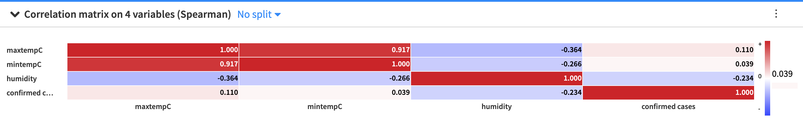

# COVID-19_vs_weather
Please wash your hands before reading this doc. :)
COVID-19 is the infectious disease caused by the most recently discovered coronavirus. This new virus and disease were unknown before the outbreak began in Wuhan, China, in December 2019.

There has been a lot of speculation recently about COVID-19 and how it relates to the weather. One common question is whether the spread of the virus will slow or stop when the weather warms up.

According to the World Health Organization and the evidence scientists have been able to gather so far, COVID-19 can be transmitted in all areas, including those with hot and humid weather. They also say there is no reason to believe that cold weather or snow can kill the COVID-19 virus. 

This analysis is done to see the possible relationship between the variables “confirmed cases” and “weather” based on data. The first thing we did is find the most updated report regarding corona from kaggle (https://www.kaggle.com/medyasun/corona-virus-complete-dataset). The data is sourced from the World Health Organization (WHO) and it is published daily . The main section of the Situations Reports are long tables of the latest number of confirmed cases and confirmed deaths by country. The latest and downloaded version of the data is available here in this repo corona-virus-complete-dataset.

Correlation matrix weather vs Covid-19 
