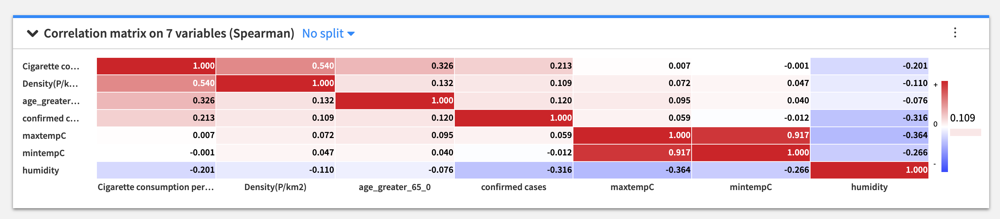

## COVID-19 confirmed cases vs weather, Population Age greater than 65, population density, cigarette smoking population
Please wash your hands before reading this doc. :)
COVID-19 is the infectious disease caused by the most recently discovered coronavirus. This new virus and disease were unknown before the outbreak began in Wuhan, China, in December 2019.

There has been a lot of speculation recently about COVID-19 and how it relates to the weather. One common question is whether the spread of the virus will slow or stop when the weather warms up.

According to the World Health Organization and the evidence scientists have been able to gather so far, COVID-19 can be transmitted in all areas, including those with hot and humid weather. They also say there is no reason to believe that cold weather or snow can kill the COVID-19 virus. 

This analysis is done to see the possible relationship between the variables “confirmed cases” and “weather” based on data. The first thing we did is find the most updated report regarding corona from kaggle (https://www.kaggle.com/medyasun/corona-virus-complete-dataset). The data is sourced from the World Health Organization (WHO) and it is published daily . The main section of the Situations Reports are long tables of the latest number of confirmed cases and confirmed deaths by country. The latest and downloaded version of the data is available here in this repo corona-virus-complete-dataset.

Using WorldWeatherOnline historical weather data API wrapper the weather data was downloaded and merged with the covid-19 dataset for correlation analysis.

The final processed data is "weather_case_combined.csv". The cases relationship with tempreture is depicted in "Avg. of cases by tempC.png" From the graph we can say that the highest the tempreture the lowest the confirmed cases are. However, it is hard to confirm this without considering other attributes like number of smokers, age, population dencity etc...

# Correlation Matrix
A correlation matrix is a table showing correlation coefficients between variables. Each cell in the table shows the correlation between two variables. A correlation matrix is used to summarize data, as an input into a more advanced analysis, and as a diagnostic for advanced analyses.

Correlation matrix between confirmed cases vs weather, Population Age greater than 65, population density, cigarrette smoking population

# Conclusion

Looking into the above correlation matrix the conclusion drawn is there is a weak postive correlation between covid-19 and other variables. The research we have done cannot fully conclude there correlation as weak postive correlation due to the fact the dataset we have used is small and also there were some considerations we have made. They are:
            - We took the temperature of the country.
            - We have considered the number of population with age greater than 65.
Because the spread of coronavirus is at it's early stage and datasets that are contain full information are not available currently the research finished stating the correlation is weak postive correlation. 

# Dataset sources

- Covid-19 dataset -  https://www.kaggle.com/medyasun/corona-virus-complete-dataset
- Population density - https://www.worldometers.info/world-population/population-by-country/
- cigratte consumer - https://en.wikipedia.org/wiki/List_of_countries_by_cigarette_consumption_per_capita
- Population greater than 65 - https://data.worldbank.org/indicator/SP.POP.65UP.TO

# Contributors

- Behailu Dereje
- Bitseat Tadesse
- Hana Sinishaw
- Yenatfenta Shiferaw
