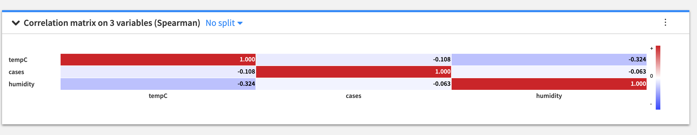

## COVID-19 confirmed cases vs weather, Population Age greater than 65, population density, cigarette smoking population
Please wash your hands before reading this doc. :)
COVID-19 is the infectious disease caused by the most recently discovered coronavirus. This new virus and disease were unknown before the outbreak began in Wuhan, China, in December 2019.

There has been a lot of speculation recently about COVID-19 and how it relates to the weather. One common question is whether the spread of the virus will slow or stop when the weather warms up.

According to the World Health Organization and the evidence scientists have been able to gather so far, COVID-19 can be transmitted in all areas, including those with hot and humid weather. They also say there is no reason to believe that cold weather or snow can kill the COVID-19 virus. 

The aim of this analysis work is to see the possible relationship or correlation between the variables “confirmed cases” and “weather” based on the theory.

# Correlation Matrix 
A correlation matrix is a table showing correlation coefficients between variables. Each cell in the table shows the correlation between two variables. A correlation matrix is used to summarize data, as an input into a more advanced analysis, and as a diagnostic for advanced analyses.
In this work, Spearman method is used than others to perform the correlation since it can be able to assess monotonic relationships (whether linear or not).

Therefore, the first thing we did is find the most updated report regarding corona from kaggle (https://www.kaggle.com/medyasun/corona-virus-complete-dataset). The data is sourced from the World Health Organization (WHO) and it is published daily . The main section of the Situations Reports are long tables of the latest number of confirmed cases and confirmed deaths by country. The latest and downloaded version of the data is available here in this repo corona-virus-complete-dataset.

Using WorldWeatherOnline historical weather data API wrapper (https://github.com/ekapope/WorldWeatherOnline) the weather data was downloaded for the whole countries in the world and merged with the covid-19 dataset for correlation analysis.The final processed data for the whole country in the world is found in Data folder with the name "weather_case_combined.csv". The preprocessing is done with the python scripts preprocess and merge_csv. The result of the correlation is shown below.

In addition,the confirmed cases relationship with temperature is depicted in "Avg. of cases by tempC.png".The graph is obtained using Dataiku DSS visual analysis tool.From the graph we can say that the highest the temperature the lowest the confirmed cases are. However, it is hard to confirm this without considering other attributes like number of smokers, age, population density etc...

Consequently after adding attributes such as Number of cigarette consumption per capita,number of people with age greater than 65 and population density and the weather data still being present, correlation of the top20 countries of highest confirmed cases with these attributes have been identified. The preprocessed data can be found in Data folder with the name top_20_all_dataset and the final result is displayed below.

# Conclusion

Looking into the above correlation matrix the conclusion drawn is there is a weak postive correlation between covid-19 and other variables. The research we have done cannot fully conclude the correlation as weak postive correlation due to the fact that the dataset we have used is small and also there were some considerations we have made. These are:
- We took the temperature of the country.
- We have considered the number of population with age greater than 65.
- Cigarette consumption per capita because of unavailability of number of smokers data for each country.

Because the spread of coronavirus is at its early stage and datasets that may contain full information are not available currently,this work will be concluded stating that the correlation found using the mentioned data is weak positive correlation. 

# Dataset sources

- Covid-19 dataset -  https://www.kaggle.com/medyasun/corona-virus-complete-dataset
- Population density - https://www.worldometers.info/world-population/population-by-country/
- cigratte consumer - https://en.wikipedia.org/wiki/List_of_countries_by_cigarette_consumption_per_capita
- Population greater than 65 - https://data.worldbank.org/indicator/SP.POP.65UP.TO

# Tool used for Analysis
- Dataiku DSS. It provides a common ground for data experts and explorers, a repository of best practices, and shortcuts to machine learning and AI deployment/management. Here it was used for both preprocessing and building correlation matrix.

# Contributors

- Behailu Dereje
- Bitseat Tadesse
- Hana Sinishaw
- Yenatfanta Shifferaw
